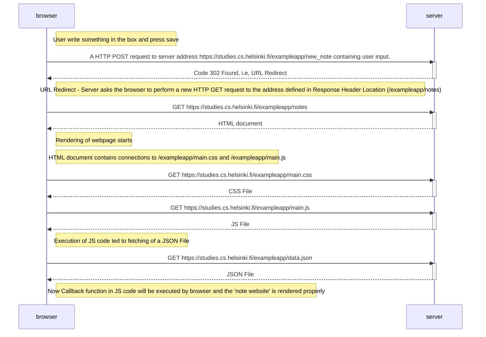

> Create a Diagram depicting what happens in the situation where the user creates a new note on the [Website](https://studies.cs.helsinki.fi/exampleapp/notes) by writing something into the text field and clicking the _Save_ button.

